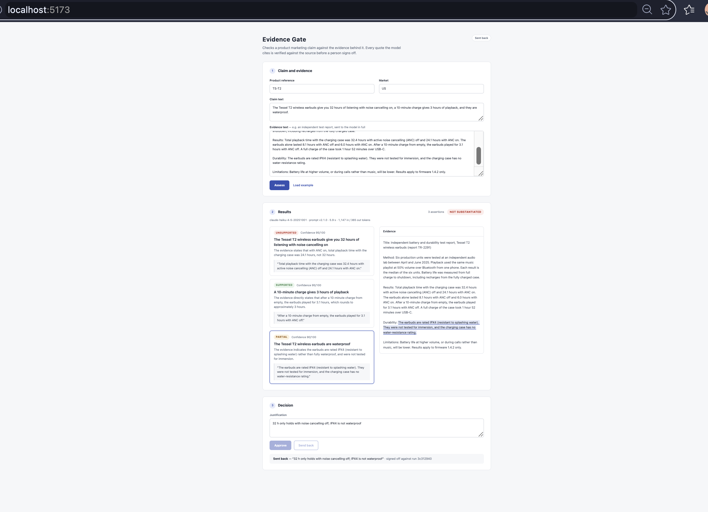
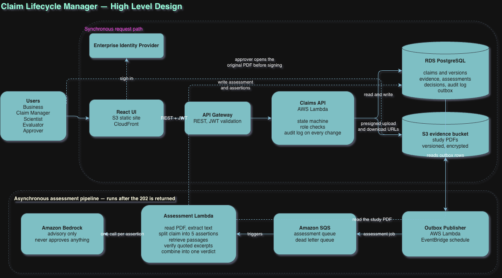

# Evidence Gate

Checks a product marketing claim against the evidence behind it, verifies every quote the model cites against the source text, and puts human sign-off behind a governance gate.



## What it does

- **Verifies every quote the model cites.** Each assertion must be backed by a passage copied from the evidence. The passage is checked by exact match, tolerant of whitespace, quote-mark, dash and letter-case differences but never of digits, units or percent signs. A quote that is not in the source forces its assertion to UNSUPPORTED, whatever verdict or confidence the model gave.
- **Breaks a claim into its individual assertions** and gives each a verdict (SUPPORTED, PARTIAL, UNSUPPORTED), a confidence score, a one-sentence rationale and the quoted passage. The overall verdict is derived in code from the verified assertions, not taken from the model.
- **Records how every verdict was produced.** Each run stores the exact dated model ID, the prompt version and a hash of the prompt actually sent, temperature, token counts, latency and the unedited model response. The evidence is hashed so later edits are detectable, and re-assessments add new runs instead of overwriting old ones.
- **Gates human sign-off.** Approve or send back requires a justification and is refused with `409 Conflict` until the claim has been assessed. Each decision is recorded against the exact run it signed off.

## Quickstart

Requires Node 22+, pnpm 10 and a local PostgreSQL server.

```bash
createdb evidence_gate
pnpm install
cp backend/.env.example backend/.env   # set DATABASE_URL and your model API key
pnpm --filter backend exec prisma migrate deploy
pnpm --filter backend db:seed
```

Then, in two terminals:

```bash
pnpm dev:backend   # API on http://localhost:3000
pnpm dev:web       # UI on http://localhost:5173
```

Open http://localhost:5173, click **Load example**, then **Assess**. The example is a fictional pair of wireless earbuds whose advertised battery life and water resistance go further than their test report supports.

### Tests

Neither suite calls the model API or needs a key.

```bash
pnpm test                                        # unit tests
createdb evidence_gate_test && pnpm test:e2e     # HTTP + PostgreSQL, model API faked
```

## Commands

Run from the repository root.

| Command | What it does |
|---|---|
| `pnpm install` | Install both packages and generate the database client |
| `pnpm dev` | Start the API and the UI together in one terminal |
| `pnpm dev:backend` | API only, restarts on change: http://localhost:3000 |
| `pnpm dev:web` | UI only: http://localhost:5173, forwards `/api` to the API |
| `curl http://localhost:3000/api/health` | Check the API is up; returns `{"status":"ok"}` |
| `pnpm --filter backend exec prisma migrate deploy` | Apply existing migrations to the database in `DATABASE_URL` |
| `pnpm --filter backend db:migrate` | After editing `schema.prisma`: create and apply a new migration |
| `pnpm --filter backend db:seed` | Insert, or reset, the example claim |
| `pnpm --filter backend prisma:generate` | Regenerate the database client (also runs on install) |
| `pnpm test` | Unit tests; no database or API key needed |
| `pnpm test:e2e` | End-to-end tests against `evidence_gate_test`; create it once with `createdb evidence_gate_test` |
| `pnpm --filter backend typecheck` | Type-check the API |
| `pnpm --filter web typecheck` | Type-check the UI |
| `pnpm build` | Production build of both packages |
| `pnpm --filter backend start` | Run the built API from `backend/dist` |
| `pnpm --filter web preview` | Serve the built UI locally: http://localhost:4173 |
| `psql -d evidence_gate -f docs/queries.sql` | Inspect the data and check the audit invariants (below) |

### Configuration

Settings live in `backend/.env`, copied from `backend/.env.example`:

- `DATABASE_URL`: the PostgreSQL connection string.
- The model API key (second line of `.env.example`). Required: the API refuses to start without it.
- Optional: `PORT` (API port, default `3000`), `WEB_ORIGIN` (allowed browser origins, comma-separated, default `http://localhost:5173`), `TEST_DATABASE_URL` (end-to-end test database, default `DATABASE_URL` with `_test` appended).

### Inspecting the database

[`docs/queries.sql`](docs/queries.sql) holds read-only queries for each feature: claims, run provenance, the latest run's assertions with the exact passage each quote matched, where the pipeline overrode the model, decisions, evidence integrity and spend. Its invariant section must return zero rows; a row there means an audit record is inconsistent. Run the whole file with the command above, or paste single queries into psql or pgAdmin.

## Production design



The end-to-end request flow is in [SEQUENCE.md](SEQUENCE.md).

The running code implements the core assessment loop: claim intake, splitting a claim into assertions, per-assertion verdicts with quote verification, the derived overall verdict, run provenance, and the human decision gate with its `409`.

Retrieval, asynchronous processing and object storage are designed but not built. This proof of concept sends the whole evidence text to the model in one synchronous request and stores evidence as text in PostgreSQL. Sign-in and roles, per-market decisions, claim versioning and the audit log shown in the design are also not built yet.

## What I would do next

- **Retrieval at scale.** Split long documents into chunks and retrieve the most relevant passages for each assertion, with one model call per assertion as in the design. Quotes would still be verified against the full extracted text, not just the retrieved chunks.
- **Async processing with an outbox.** Return `202 Accepted` from assess and write the job to an outbox table in the same transaction as the claim change. A publisher moves outbox rows to a queue, workers retry with backoff, and repeated failures land in a dead-letter queue while the UI polls for the result. No job is lost or run twice because the API crashed between the database write and the enqueue.
- **PDF ingestion.** Upload evidence documents to object storage through presigned URLs, extract text with a page map so every verified quote can be cited by page, and hash the original file as well as the extracted text, so an approver can open the source PDF at the cited page before signing.
