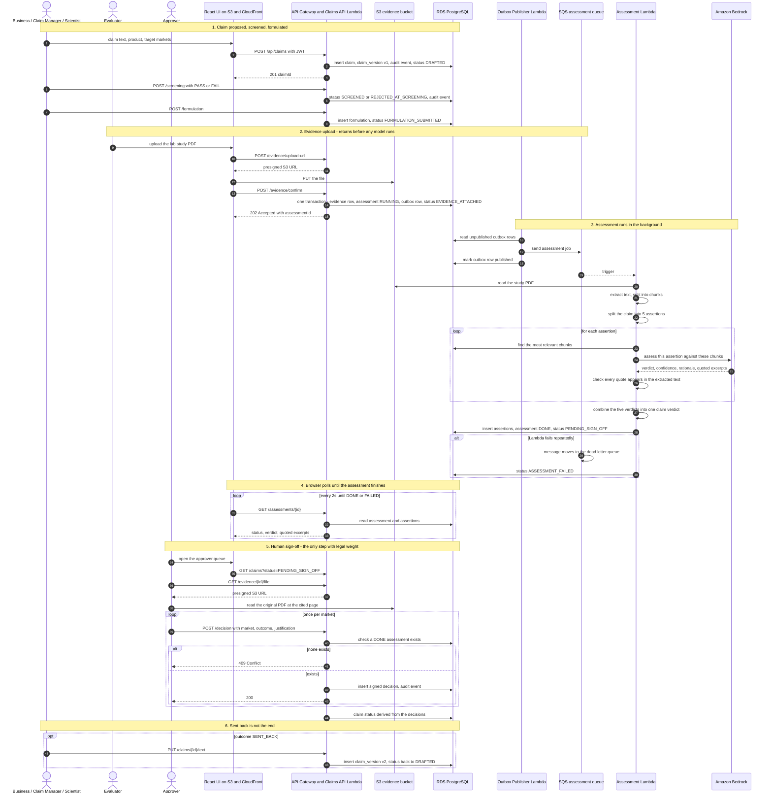

# Claim Lifecycle Manager — Sequence

```mermaid
sequenceDiagram
    autonumber
    actor USER as Business / Claim Manager / Scientist
    actor EVAL as Evaluator
    actor APPR as Approver
    participant UI as React UI on S3 and CloudFront
    participant API as API Gateway and Claims API Lambda
    participant S3 as S3 evidence bucket
    participant DB as RDS PostgreSQL
    participant PUB as Outbox Publisher Lambda
    participant SQS as SQS assessment queue
    participant ASSESS as Assessment Lambda
    participant BR as Amazon Bedrock

    Note over USER,DB: 1. Claim proposed, screened, formulated
    USER->>UI: claim text, product, target markets
    UI->>API: POST /api/claims with JWT
    API->>DB: insert claim, claim_version v1, audit event, status DRAFTED
    API-->>UI: 201 claimId
    USER->>API: POST /screening with PASS or FAIL
    API->>DB: status SCREENED or REJECTED_AT_SCREENING, audit event
    USER->>API: POST /formulation
    API->>DB: insert formulation, status FORMULATION_SUBMITTED

    Note over EVAL,SQS: 2. Evidence upload - returns before any model runs
    EVAL->>UI: upload the lab study PDF
    UI->>API: POST /evidence/upload-url
    API-->>UI: presigned S3 URL
    UI->>S3: PUT the file
    UI->>API: POST /evidence/confirm
    API->>DB: one transaction - evidence row, assessment RUNNING, outbox row, status EVIDENCE_ATTACHED
    API-->>UI: 202 Accepted with assessmentId

    Note over PUB,BR: 3. Assessment runs in the background
    PUB->>DB: read unpublished outbox rows
    PUB->>SQS: send assessment job
    PUB->>DB: mark outbox row published
    SQS-->>ASSESS: trigger
    ASSESS->>S3: read the study PDF
    ASSESS->>ASSESS: extract text, split into chunks
    ASSESS->>ASSESS: split the claim into 5 assertions

    loop for each assertion
        ASSESS->>DB: find the most relevant chunks
        ASSESS->>BR: assess this assertion against these chunks
        BR-->>ASSESS: verdict, confidence, rationale, quoted excerpts
        ASSESS->>ASSESS: check every quote appears in the extracted text
    end

    ASSESS->>ASSESS: combine the five verdicts into one claim verdict
    ASSESS->>DB: insert assertions, assessment DONE, status PENDING_SIGN_OFF

    alt Lambda fails repeatedly
        SQS->>SQS: message moves to the dead letter queue
        ASSESS->>DB: status ASSESSMENT_FAILED
    end

    Note over UI,DB: 4. Browser polls until the assessment finishes
    loop every 2s until DONE or FAILED
        UI->>API: GET /assessments/{id}
        API->>DB: read assessment and assertions
        API-->>UI: status, verdict, quoted excerpts
    end

    Note over APPR,DB: 5. Human sign-off - the only step with legal weight
    APPR->>UI: open the approver queue
    UI->>API: GET /claims?status=PENDING_SIGN_OFF
    APPR->>API: GET /evidence/{id}/file
    API-->>APPR: presigned S3 URL
    APPR->>S3: read the original PDF at the cited page

    loop once per market
        APPR->>API: POST /decision with market, outcome, justification
        API->>DB: check a DONE assessment exists
        alt none exists
            API-->>APPR: 409 Conflict
        else exists
            API->>DB: insert signed decision, audit event
            API-->>APPR: 200
        end
    end

    API->>DB: claim status derived from the decisions

    Note over USER,DB: 6. Sent back is not the end
    opt outcome SENT_BACK
        USER->>API: PUT /claims/{id}/text
        API->>DB: insert claim_version v2, status back to DRAFTED
    end
```
